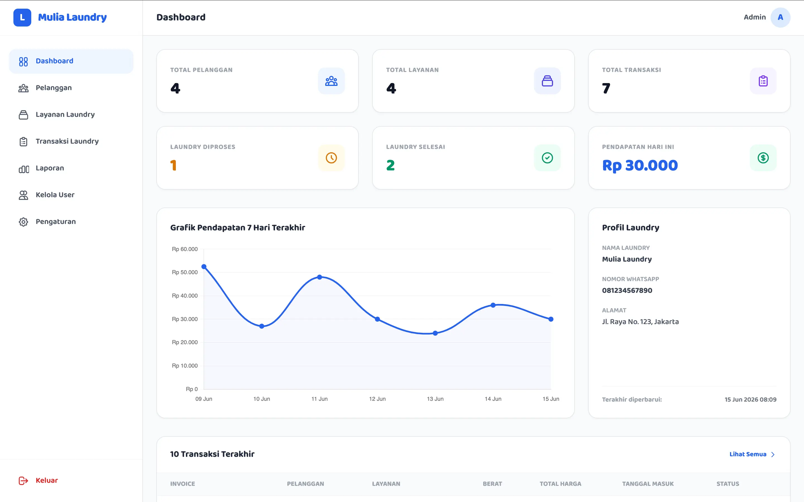
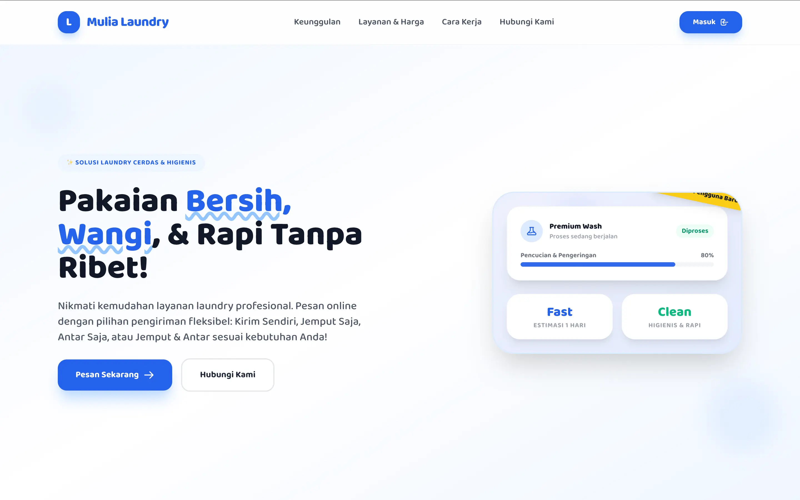
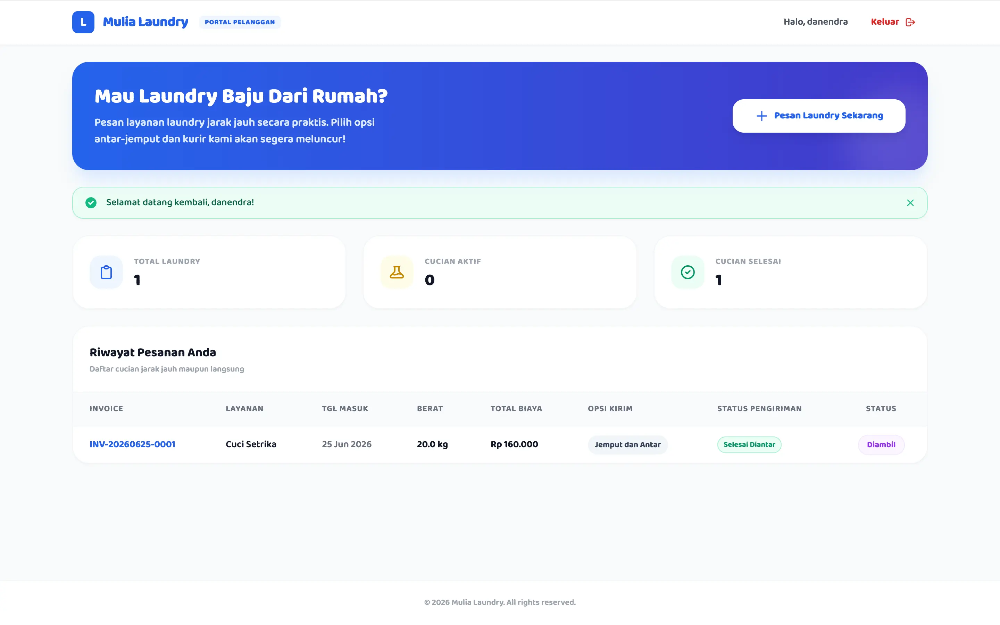
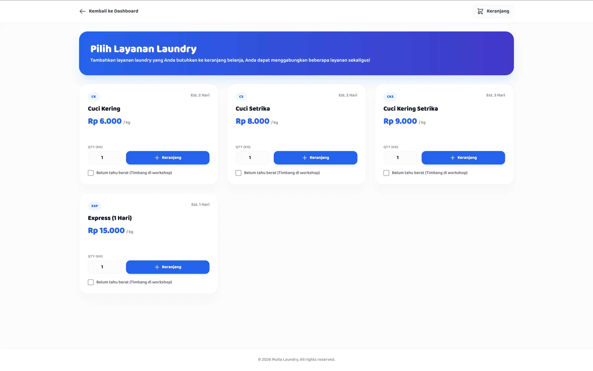

# Laundry Management System (LMS)

LMS (Laundry Management System) adalah aplikasi berbasis web yang dirancang untuk memudahkan operasional bisnis laundry secara terpusat bagi admin/staff, sekaligus menyediakan portal pemesanan online bagi pelanggan.



---

## Fitur Proyek (Update UAS)

Sistem ini memiliki dua kategori akses utama: **Landing Page & Portal Pelanggan** (Publik) serta **Dashboard Internal** (Admin/Staff).

### 1. Landing Page Pelanggan
Halaman utama interaktif yang dapat diakses oleh publik untuk mengetahui informasi toko laundry:
- **Informasi Layanan**: Menampilkan daftar harga per kg, estimasi pengerjaan, dan status keaktifan layanan secara real-time dari database.
- **Cara Pemesanan**: Alur pemesanan mudah bagi pelanggan baru.
- **Informasi Kontak**: Nama toko, nomor WhatsApp interaktif, dan alamat lengkap laundry (dapat diubah dinamis dari pengaturan admin).



### 2. Portal & Dashboard Pelanggan
Portal mandiri bagi pelanggan setelah melakukan registrasi/login:
- **Registrasi Akun**: Pelanggan dapat mendaftar sendiri melalui halaman `/register` yang otomatis akan membuat data profil pelanggan baru.
- **Pemesanan Mandiri & Keranjang Belanja (Shopping Cart)**: Memilih dan memesan beberapa layanan laundry sekaligus dalam satu pesanan terintegrasi. Didukung oleh package `jason-napolitano/codeigniter4-cart-module`.
- **Alternatif "Timbang di Toko"**: Pilihan apabila pelanggan belum mengetahui berat pasti cuciannya. Sistem akan otomatis menyetel berat awal `0.00` (ditampilkan sebagai status *Menunggu Timbang* di dashboard) dan membiarkan petugas admin melakukan penimbangan serta memperbarui total harga setelah pakaian sampai di workshop.
- **Opsi Pengiriman & Penjemputan**:
  - `Kirim Sendiri` (Pelanggan mengantar baju ke toko)
  - `Jemput Saja` (Petugas mengambil baju ke alamat pelanggan)
  - `Antar Saja` (Petugas mengantar baju kembali ke pelanggan setelah selesai)
  - `Jemput dan Antar` (Layanan penuh antar-jemput)
- **Alamat Pengiriman**: Wajib diisi jika memilih opsi jemput/antar.
- **Pelacakan Status Real-time**: Pelanggan dapat memantau status cucian (`Menunggu`, `Diproses`, `Selesai`, `Diambil`) serta status pengiriman (`None`, `Menunggu Penjemputan`, `Dalam Penjemputan`, `Selesai Dijemput`, `Menunggu Pengantaran`, `Dalam Pengantaran`, `Selesai Diantar`).




---

### 3. Dashboard Admin & Staff
Aplikasi internal untuk mengelola operasional bisnis laundry:
- **Dashboard**: Ringkasan statistik (Total Pelanggan, Total Layanan, Total Transaksi, Pendapatan Hari Ini), aktivitas transaksi terbaru, serta grafik pendapatan 7 hari terakhir menggunakan Chart.js.
- **Kelola Pelanggan**: Pencatatan data pelanggan laundry lengkap dengan nama, nomor kontak, alamat, pencarian, dan paginasi data (mendukung soft deletes).
- **Layanan Laundry**: Konfigurasi jenis layanan (Cuci Kering, Cuci Setrika, dll) beserta harga per kg, estimasi pengerjaan, dan status aktif/nonaktif.
- **Transaksi Laundry**:
  - Pencatatan transaksi masuk (offline & online).
  - Kalkulasi biaya otomatis (Berat × Harga per Kg) setelah pakaian ditimbang oleh admin.
  - Penomoran invoice otomatis (`INV-YYYYMMDD-XXXX`).
  - Pembaruan status cucian secara langsung.
  - **Pembaruan Status Pengiriman**: Mengubah status pengantaran/penjemputan cucian pelanggan secara bertahap.
- **Laporan & Pendapatan**: Filter laporan berdasarkan periode waktu (Hari Ini, Minggu Ini, Bulan Ini, Kustom), ringkasan metrik keuangan, serta fitur ekspor laporan ke dalam format **Excel/CSV** dan cetak **PDF** menggunakan library **DOMPDF**.
- **Kelola User**: Manajemen data pengguna internal (tambah, ubah password opsional, pencarian, dan hapus user) dengan keamanan anti-self-delete.
- **Pengaturan**: Modifikasi profil laundry (nama toko, WhatsApp, alamat, logo) serta pembaruan profil pengguna & password.

---

## Teknologi
- **Backend**: PHP 8.2+ & CodeIgniter 4 (MVC)
- **Database**: MySQL 8+ (Mendukung Foreign Keys, Migrations, Seeders, dan Soft Deletes)
- **Frontend**: Tailwind CSS & Google Fonts "Baloo 2"
- **Ekspor Dokumen**: DOMPDF (PDF) & Native CSV Generator
- **Autentikasi & Keamanan**: Session Auth Filter (Admin & Customer), Password Hashing (bcrypt), dan CSRF Protection

---

## Cara Instalasi & Menjalankan Proyek

### 1. Buat Database
Buat database baru bernama `laundry_db` pada MySQL server Anda:
```sql
CREATE DATABASE laundry_db;
```

### 2. Konfigurasi Lingkungan
Pastikan berkas `.env` sudah terbuat di direktori root proyek. Konfigurasikan detail database Anda di dalamnya:
```ini
database.default.hostname = localhost
database.default.database = laundry_db
database.default.username = root
database.default.password = root   # Sesuaikan dengan password database lokal Anda
```

### 3. Jalankan Migrasi & Database Seeder
Lakukan inisialisasi tabel-tabel database beserta data dummy awal (admin default, data pelanggan, jenis layanan, dan riwayat transaksi 7 hari terakhir):
```bash
php spark migrate:refresh && php spark db:seed DatabaseSeeder
```

### 4. Jalankan Server Lokal
Jalankan server pengembangan bawaan CodeIgniter:
```bash
php spark serve
```
Aplikasi sekarang dapat diakses melalui browser Anda di: **`http://localhost:8080`**

---

## Kredensial Login Default
Gunakan akun bawaan hasil seeding untuk masuk ke sistem dashboard admin:
- **Username**: `admin`
- **Password**: `admin123`

Untuk mengakses portal pelanggan, Anda dapat melakukan **Registrasi Akun Baru** secara mandiri melalui tombol daftar di halaman login/landing page.
